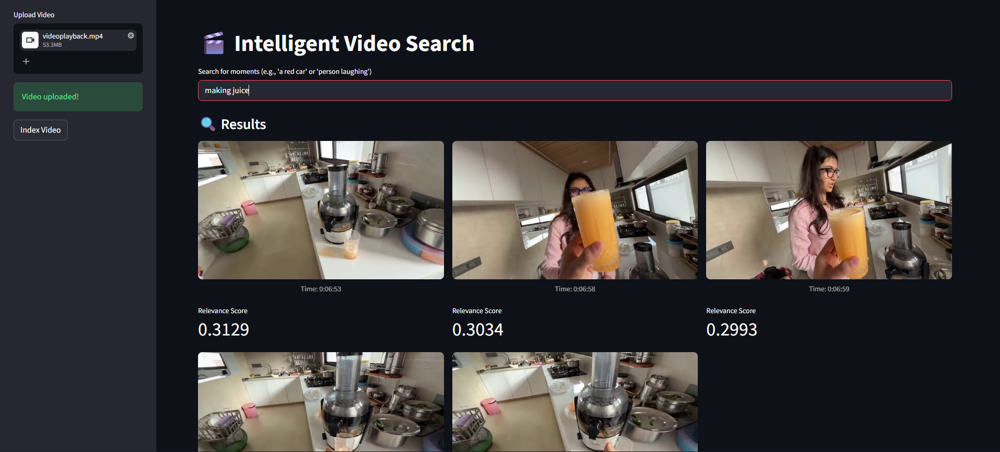
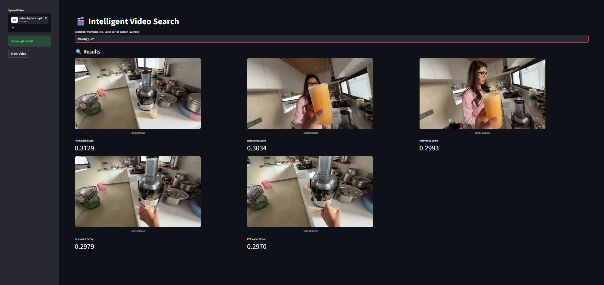

The system follows a modular RAG (Retrieval-Augmented Generation) architecture tailored for computer vision. The pipeline begins with Video Ingestion, where the VideoSearchEngine class uses OpenCV to decode the video and sample frames at a specified rate (e.g., 1 frame per second) to balance temporal coverage with computational efficiency. Each sampled frame is passed through the CLIP (Contrastive Language-Image Pretraining) model, which generates a dense visual-semantic embedding—a multi-dimensional vector representing the "meaning" of the frame. These vectors are then indexed in FAISS (Facebook AI Similarity Search), a library designed for high-speed approximate nearest neighbor (ANN) search, allowing for sub-second retrieval regardless of the video's length. When you enter a natural language query in the Streamlit UI, the CLIP text-encoder converts your words into the same vector space as the frames. The system then calculates the cosine similarity between your query vector and all indexed frame vectors, returning the top-K results with their respective timestamps and relevance scores. This end-to-end flow ensures that the "one-time" offline indexing cost pays off with near-instantaneous search performance during the query phase.

  

  

